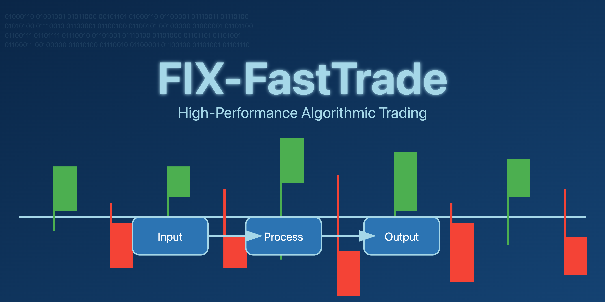

# FIX-FastTrade



[](https://github.com/muditbhargava66/FIX-FastTrade/blob/main/LICENSE)
[](https://fix-fasttrade.readthedocs.io/en/latest/?badge=latest)
[](https://github.com/muditbhargava66/FIX-FastTrade/actions/workflows/github-code-scanning/codeql)
[](https://github.com/muditbhargava66/FIX-FastTrade/stargazers)
[](https://github.com/muditbhargava66/FIX-FastTrade/network/members)


[](https://github.com/muditbhargava66/FIX-FastTrade/issues)
[](https://github.com/muditbhargava66/FIX-FastTrade/pulls)

FIX-FastTrade is a high-performance electronic trading system that utilizes the Financial Information eXchange (FIX) protocol for fast and reliable communication between trading parties. It is designed to handle high-volume trading scenarios with low latency and high throughput.

## Version 1.0.5

### Release Notes

- Added support for custom FIX message types and fields
- Improved error handling and logging capabilities
- Optimized memory usage and performance
- Fixed issues related to session management and reconnection
- Upgraded dependencies to the latest stable versions

### Features

- Robust implementation of the FIX protocol for secure and efficient message exchange
- Optimized for low latency and high throughput to support high-frequency trading
- Modular architecture allowing easy customization and extension
- Comprehensive test coverage to ensure reliability and stability
- Well-documented codebase and API for ease of use and integration
- Support for multiple trading platforms and market data providers
- Real-time monitoring and analytics for trade execution and risk management

### Code Directory Structure

The FIX-FastTrade project follows a well-organized directory structure to ensure code modularity and maintainability. Here's an overview of the main directories and their purposes:

```
fix-protocol-electronic-trading/
├── .clang-format
├── .clang-tidy
├── .editorconfig
├── .gitignore
├── CMakeLists.txt
├── LICENSE
├── README.md
├── docs/
│   ├── api/
│   │   ├── fix_api.md
│   │   ├── model_api.md
│   │   └── service_api.md
│   ├── design/
│   │   ├── architecture.md
│   │   ├── fix_protocol.md
│   │   └── trading_system.md
│   ├── diagrams/
│   │   ├── sequence_diagram.svg
│   │   └── system_architecture.svg
│   └── user_guide.md
├── include/
│   ├── fix/
│   │   ├── Application.h
│   │   ├── Config.h
│   │   ├── MessageParser.h
│   │   └── Session.h
│   ├── model/
│   │   ├── Order.h
│   │   └── Trade.h
│   └── service/
│       ├── FixService.h
│       └── TradingService.h
├── src/
│   ├── fix/
│   │   ├── Application.cpp
│   │   ├── Config.cpp
│   │   ├── MessageParser.cpp
│   │   └── Session.cpp
│   ├── model/
│   │   ├── Order.cpp
│   │   └── Trade.cpp
│   └── service/
│       ├── FixService.cpp
│       └── TradingService.cpp
├── tests/
│   ├── CMakeLists.txt
│   ├── fix/
│   │   ├── ApplicationTest.cpp
│   │   ├── ConfigTest.cpp
│   │   ├── MessageParserTest.cpp
│   │   └── SessionTest.cpp
│   ├── model/
│   │   ├── OrderTest.cpp
│   │   └── TradeTest.cpp
│   └── service/
│       ├── FixServiceTest.cpp
│       └── TradingServiceTest.cpp
├── third_party/
│   ├── quickfix/
│   │   ├── include/
│   │   └── src/
│   └── googletest/
│       ├── include/
│       └── src/
└── tools/
    ├── build/
    │   ├── build.sh
    │   └── build.bat
    └── scripts/
        ├── run_tests.sh
        └── generate_docs.sh
```

### Getting Started

#### Prerequisites

- C++17 compiler
- CMake (version 3.10 or higher)
- Boost library (version 1.71.0 or higher)
- QuickFIX library (version 1.15.1 or higher)
- Google Test and Google Mock (optional, for running tests)

#### Installation

1. Clone the repository:
   ```bash
   git clone https://github.com/muditbhargava66/FIX-FastTrade.git
   ```

2. Navigate to the project directory:
   ```bash
   cd FIX-FastTrade
   ```

3. Create a build directory and navigate to it:
   ```bash
   mkdir build
   cd build
   ```

4. Generate the build files using CMake:
   ```bash
   cmake ..
   ```

5. Build the project:
   ```bash
   cmake --build .
   ```

6. Run the tests (optional):
   ```bash
   ctest
   ```

#### Usage

1. Configure the FIX-FastTrade system by modifying the configuration files in the `config` directory.

2. Start the FIX-FastTrade executable:
   ```bash
   ./bin/fix-fasttrade
   ```

3. The FIX-FastTrade system will start running and will be ready to handle incoming FIX messages and execute trades.

4. You can interact with the FIX-FastTrade system using a FIX client or by integrating it with your existing trading infrastructure.

### Configuration

The FIX-FastTrade system can be configured using the configuration files located in the `config` directory. The main configuration file is `config.txt`, which contains settings for the FIX session, connectivity, and other system parameters.

Modify the configuration files according to your specific requirements, such as the FIX version, sender and target CompIDs, connection settings, and logging preferences.

### Documentation

The FIX-FastTrade project provides comprehensive documentation to help users understand and utilize the system effectively. The documentation includes:

- API documentation: Detailed information about the FIX API, Model API, and Service API.
- Design documentation: Architectural overview, FIX protocol integration, and trading system design.
- Diagrams: Sequence diagram illustrating the flow of messages and system architecture diagram providing a high-level overview.
- User guide: Instructions on how to use and interact with the FIX-FastTrade system.

Please refer to the `docs` directory for the complete documentation.

## System Design

The following diagrams provide visual documentation of the FIX-FastTrade system:

- [Sequence Diagram](docs/diagrams/sequence_diagram.png): Illustrates the flow of messages and interactions between the key components of the system during a typical trading scenario.

- [System Architecture Diagram](docs/diagrams/system_architecture.png): Provides a high-level overview of the system's architecture, showcasing the main components and their interactions.

### Contributing

Contributions to FIX-FastTrade are welcome! If you encounter any issues, have suggestions for improvements, or want to add new features, please open an issue or submit a pull request on the GitHub repository.

When contributing, please follow the existing coding style, write unit tests for any new functionality, and ensure that all tests pass before submitting a pull request.

### License

FIX-FastTrade is open-source software licensed under the [MIT License](LICENSE).

## Contact

For any questions, feedback, or inquiries, please contact the maintainers at [Mudit Bhargava](https://github.com/muditbhargava66).

---