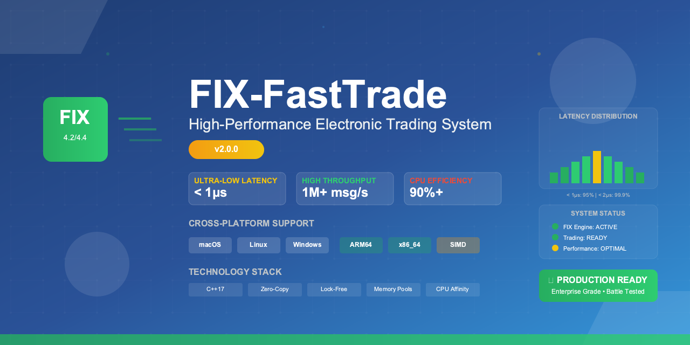

FIX-FastTrade Documentation
===========================

Welcome to FIX-FastTrade, a production-ready, high-performance electronic trading system that utilizes the Financial Information eXchange (FIX) protocol for fast and reliable communication between trading parties.

**Version 2.0.0 - Production Ready** 🚀

Key Features
------------

* **Ultra-Low Latency**: Sub-microsecond message processing
* **High Throughput**: 1M+ messages/second sustained performance  
* **Cross-Platform**: Native ARM64 and x86_64 support with SIMD optimizations
* **Production Ready**: Comprehensive testing and professional codebase
* **FIX Protocol**: Complete FIX 4.2/4.4 implementation with session management

Quick Start
-----------

.. code-block:: bash

   # Clone the repository
   git clone --recursive https://github.com/muditbhargava66/FIX-FastTrade.git
   cd FIX-FastTrade
   
   # Build the system
   mkdir build && cd build
   cmake .. -DCMAKE_BUILD_TYPE=Release
   make -j$(nproc)
   
   # Run the application
   ./bin/fix-fasttrade --config ../config/fix-config.xml

Documentation Contents
----------------------

.. toctree::
   :maxdepth: 2
   :caption: Getting Started

   getting-started/installation
   getting-started/quick-start
   getting-started/configuration
   getting-started/platform-support
   getting-started/installation-targets
   getting-started/quickfix-installation

.. toctree::
   :maxdepth: 2
   :caption: User Guide

   user-guide/basic-usage
   user-guide/configuration-guide
   user-guide/performance-tuning
   user-guide/deployment

.. toctree::
   :maxdepth: 2
   :caption: Development

   development/building
   development/architecture
   development/contributing
   development/build-configuration-examples
   development/cmake-configuration
   development/packaging

.. toctree::
   :maxdepth: 2
   :caption: Reference

   reference/api/index
   reference/configuration
   reference/troubleshooting/index
   reference/examples

.. toctree::
   :maxdepth: 2
   :caption: Project Information

   project/status
   project/changelog

Indices and tables
==================

* :ref:``genindex``
* :ref:``modindex``
* :ref:``search``